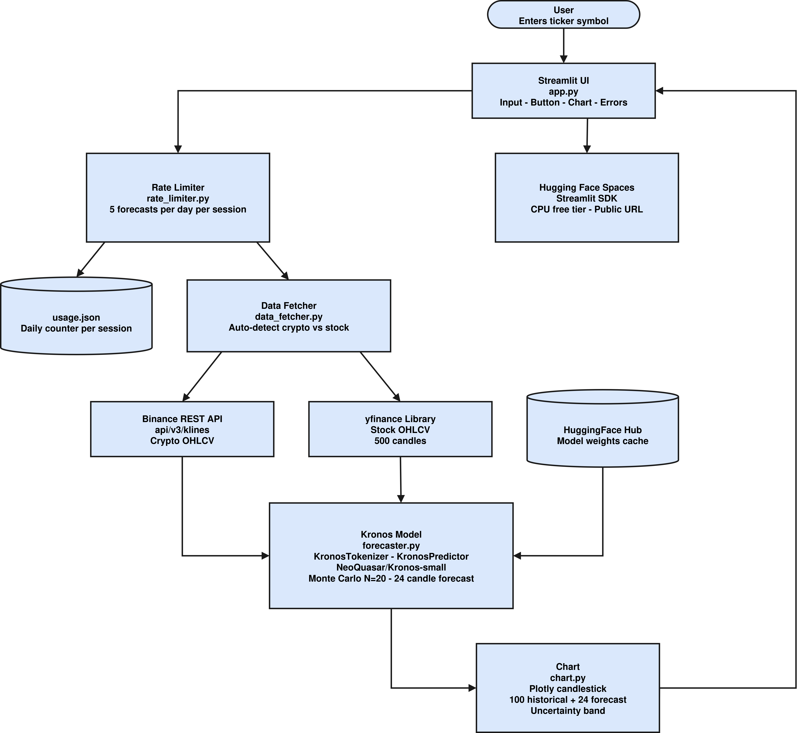

<div align="center">

# Kronos AI — Candlestick Forecasting

**A Streamlit web application that generates 24-hour AI candlestick forecasts for crypto pairs and stocks, powered by the open-source [Kronos](https://github.com/shiyu-coder/Kronos) financial time-series model.**

<br/>

<p align="center">
  
  &nbsp;&nbsp;&nbsp;
  
  &nbsp;&nbsp;&nbsp;
  
  &nbsp;&nbsp;&nbsp;
  
  &nbsp;&nbsp;&nbsp;
  
  &nbsp;&nbsp;&nbsp;
  
  &nbsp;&nbsp;&nbsp;
  
  &nbsp;&nbsp;&nbsp;
  
</p>

<br/>

<p align="center">
  
</p>

<p align="center"><sub><i>System architecture — data sources, model pipeline, and UI layer.</i></sub></p>

</div>

---

## Overview

Kronos AI Forecasting is a Streamlit web application that lets users enter a ticker symbol — either a crypto pair (`BTC/USDT`, `ETH/USDT`, `SOL/USDT`) or a stock symbol (`AAPL`, `TSLA`, `NVDA`) — and instantly receive a probabilistic 24-hour candlestick forecast. The application auto-detects the asset class, fetches 500 hours of OHLCV history from the appropriate public data source, runs the open-source [Kronos](https://github.com/shiyu-coder/Kronos) financial transformer in Monte Carlo mode, and renders an interactive Plotly chart that shows the predicted candlesticks together with a shaded uncertainty cone.

The entire pipeline runs on CPU, requires no API keys from the user, and deploys to Hugging Face Spaces with one click.

---

## Features

- Auto-detection of asset type from the ticker format — no manual selection required.
- Crypto pairs (`BTC/USDT`, `ETH/USDT`, etc.) via the **Binance** public REST API, no API key required.
- Stocks (`AAPL`, `TSLA`, `NVDA`, etc.) via **Yahoo Finance** through the `yfinance` package.
- **Kronos** financial foundation model loaded directly from the Hugging Face Hub:
  - Tokenizer: [`NeoQuasar/Kronos-Tokenizer-base`](https://huggingface.co/NeoQuasar/Kronos-Tokenizer-base)
  - Model: [`NeoQuasar/Kronos-small`](https://huggingface.co/NeoQuasar/Kronos-small)
- Monte Carlo sampling with **N = 20** independent forecast paths to produce probabilistic predictions and a 10th–90th percentile uncertainty band on closing price.
- Clean, interactive **Plotly** candlestick chart — last 100 historical candles in blue, 24 forecast candles in orange, with the shaded uncertainty cone overlaid.
- Headline metrics displayed under the chart: current price, forecasted price after 24 hours, direction (up or down), confidence percentage based on path agreement, and a volatility outlook.
- Mobile-friendly responsive layout.
- Built-in daily rate limit of 5 forecasts per user, with a clear in-app message when the limit is reached.
- Zero secrets, zero API keys, zero paid resources — everything runs on the free Hugging Face Spaces CPU tier.

---

## How it works

1. The user enters a ticker symbol and clicks **Generate Forecast**.
2. `data_fetcher.py` inspects the ticker format. A pair such as `BTC/USDT` is routed to the Binance `/api/v3/klines` endpoint; a plain symbol such as `AAPL` is routed to `yfinance`. Both return a pandas `DataFrame` of 500 hourly OHLCV rows indexed in UTC.
3. `forecaster.py` ensures the Kronos repository is cloned locally (cloned once at startup, then re-used), adds it to `sys.path`, and lazily loads the tokenizer and model from the Hugging Face Hub. The model loader is cached with `@st.cache_resource` so the weights load only once per process.
4. The forecaster runs **20 independent Kronos predictions** of `pred_len = 24` candles each. Every path is a single Monte Carlo sample using the default temperature and top-p settings.
5. The 20 paths are aggregated into a mean OHLC forecast and a per-step 10th and 90th percentile band on closing price.
6. `chart.py` builds the Plotly figure: history in blue, forecast in orange, the shaded band drawn behind the forecast candles, and a dotted vertical line at the boundary between observed and predicted data.
7. `rate_limiter.py` records the successful forecast in a JSON file keyed by the user's session UUID. The counter resets every UTC midnight.

---

## Project structure

```
finance-streamlit/
├── app.py             Streamlit UI and orchestration
├── data_fetcher.py    Binance and yfinance OHLCV fetching
├── forecaster.py      Kronos repo bootstrap, model loading, Monte Carlo prediction
├── chart.py           Plotly candlestick chart with uncertainty band
├── rate_limiter.py    JSON-backed daily rate limit (5 per day per user)
├── requirements.txt   Pinned dependencies
├── README.md          This file
├── SysArchitecture.png  System architecture diagram
└── Kronos/            Cloned at startup from github.com/shiyu-coder/Kronos
```

The Kronos repository is cloned into `./Kronos/` on first run and added to `sys.path`, so `from model import Kronos, KronosTokenizer, KronosPredictor` works identically on local machines and on Hugging Face Spaces.

---

## Installation

> Requires Python 3.10 or newer.

```bash
git clone https://github.com/youness-mamma/stock-crypto-forecaster.git
cd stock-crypto-forecaster

python3 -m venv .venv
source .venv/bin/activate          # macOS / Linux
# .venv\Scripts\activate           # Windows PowerShell

pip install --upgrade pip
pip install -r requirements.txt
```

---

## Running locally

```bash
streamlit run app.py
```

Then open <http://localhost:8501> in your browser.

On the first run the application will:

1. Clone the Kronos repository into `./Kronos/` (one-time operation).
2. Download the tokenizer and model weights from the Hugging Face Hub (cached automatically by `huggingface_hub`).
3. Load the model onto CPU. Subsequent forecasts in the same session re-use the cached model.

Expect roughly 1–2 minutes per forecast on a typical free-tier CPU (20 Monte Carlo paths multiplied by a 24-candle horizon).

---

## Deploying to Hugging Face Spaces

This repository is Spaces-ready — the YAML block at the top of this README declares the Streamlit SDK and the entry-point file.

1. Create a new Space on Hugging Face with the **Streamlit** SDK.
2. Push every file in this repository to the Space (`git push` to the Space remote, or use the web uploader).
3. Hugging Face will install dependencies from `requirements.txt`, clone the Kronos repository on first request, and serve `app.py` automatically.

No environment variables, secrets, or API keys are required. Binance public endpoints and `yfinance` work without authentication, and Hugging Face Hub downloads `NeoQuasar/Kronos-Tokenizer-base` and `NeoQuasar/Kronos-small` anonymously.

---

## Rate limiting

The free tier allows **5 forecasts per user per day**. Usage is tracked in `.usage.json` (a local JSON file) keyed by a per-session UUID stored in Streamlit's `session_state`. The counter resets at UTC midnight every day.

When the daily limit is reached, the application displays:

> *You've reached your 5 free forecasts for today. Come back tomorrow!*

The limit is enforced before the model runs, and the counter is only incremented after a forecast completes successfully — failed runs (invalid ticker, network error, model error) do not consume the user's quota.

---

## Technology stack

- **[Python 3.10+](https://www.python.org/)** — runtime.
- **[Streamlit](https://streamlit.io/)** — web UI framework.
- **[PyTorch](https://pytorch.org/)** — neural network backend that powers the Kronos model.
- **[Hugging Face Hub](https://huggingface.co/)** and **[Transformers](https://huggingface.co/docs/transformers)** — model and tokenizer hosting and loading.
- **[Kronos](https://github.com/shiyu-coder/Kronos)** — open-source financial time-series transformer.
- **[Plotly](https://plotly.com/python/)** — interactive candlestick charts and uncertainty bands.
- **[pandas](https://pandas.pydata.org/)** and **[NumPy](https://numpy.org/)** — data manipulation and numerical aggregation.
- **[Binance public REST API](https://binance-docs.github.io/apidocs/spot/en/#kline-candlestick-data)** — crypto OHLCV source.
- **[yfinance](https://github.com/ranaroussi/yfinance)** (Yahoo Finance) — stock OHLCV source.
- **[Hugging Face Spaces](https://huggingface.co/spaces)** — deployment target with the Streamlit SDK.

---

## Disclaimer

This application is intended for **educational and research purposes only**. The forecasts are generated by a probabilistic AI model and are **not financial advice**. Financial markets are noisy and any predictive model — Kronos included — can be wrong, sometimes severely. Do not make trading or investment decisions based solely on the output of this application.

---

## License

This project is released under the MIT license. The Kronos model and tokenizer are distributed under their own licenses on Hugging Face; please consult the model cards on the Hugging Face Hub before using the weights in derivative work.
